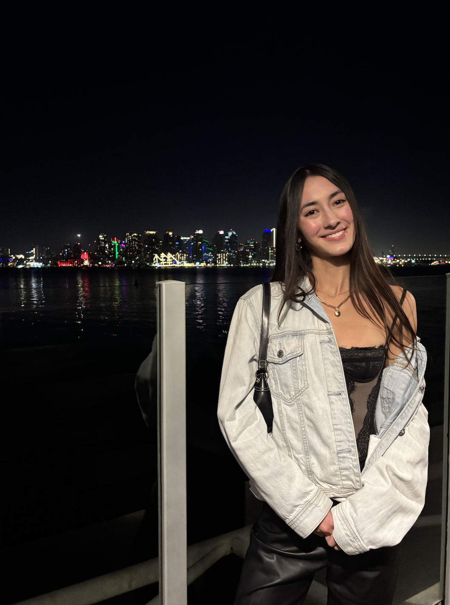
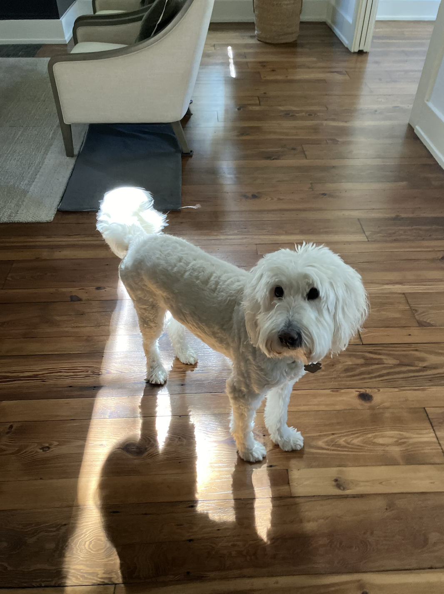
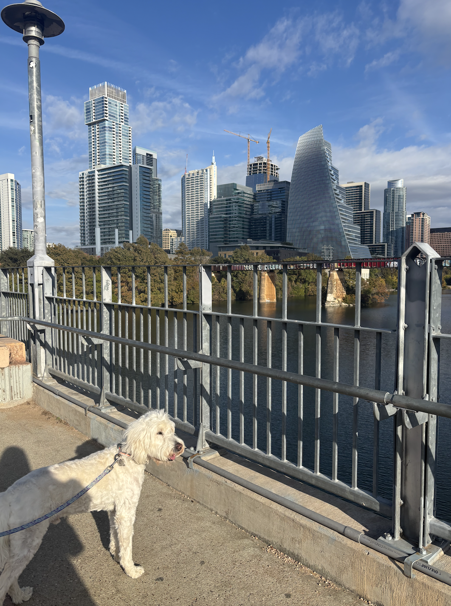

# User Page
# About Me
Hi, I'm **Eve**! I'm a fourth year **Math Computer Science** major in Revelle but originally from Austin, Texas. 

Some things I love are:
- exploring new places
- doing art
- the great outdoors
I'm also a big dog person! Below is my dog, * *Ollie* *.
 

# My Programming Journey
My love for programming didn't start until I started school here at UCSD. 
> I hadn't even taken a coding class until my freshman year of college.

I initially started UCSD as an undeclared major but switched to Math Computer Science shortly after completing my first year. Since declaring my major, I have done the following: 
1. Honed my coding skills through various CSE classes 
2. Completed a data science project through COGS 108
3. Worked as an intern at the San Diego Supercomputer Center. I worked with my team to develop an app to track favors between friends. I have continued to work with SDSC on other projects throughout this year. 
For more info on me and what I like to do outside of programming, see [this section](#about-me).

My most used terminal commands are 
```
pwd
git branch
```
because I always get lost and need to make sure I'm in the right place.

[Here](https://github.com/ejnguyen1) is my Github page.
See my [README.md](README.md) to learn what my favorite programming language is!

# CSE 110
Through this class, I hope to accomplish a couple things.
- [ ] Further my webdev skills by learning new technology and gaining more front and backend experience
- [ ] Learn more clean and efficient coding practices
- [ ] Familiarize myself with the software development lifecycle, including brainstorming and planning, not just writing code
- [ ] Make new connections in the UCSD and CS world

I'm super excited to work more with my team to develop our project!